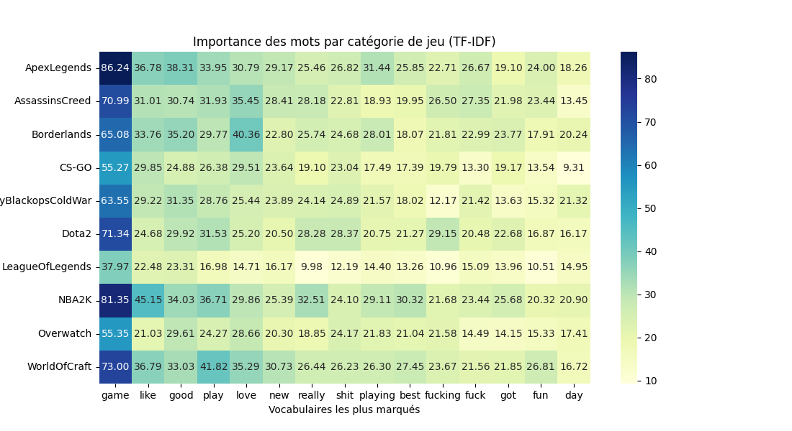

# Sentiment_Analytics_Video_Games
Analyse sentimentale des tweets sur les jeux vidéos

L'objectif principal de ce projet est de déterminer si un type de jeu est perçu comme bon, mauvais ou neutre à partir d'un ensemble de tweets, en utilisant des modèles de traitement du langage naturel (NLP) ou de Machine Learning. <br>

Dans un premier temps, nous allons explorer et analyser le jeu de données pour mieux comprendre sa structure. Cela inclura des étapes de prétraitement des données visant à nettoyer les valeurs manquantes, éliminer les doublons et améliorer la qualité du contenu des tweets afin de mieux représenter le corpus. <br>

Ensuite, nous utiliserons une méthode de pondération des mots appelée TF-IDF (Term Frequency-Inverse Document Frequency). Cette méthode permettra d'identifier la fréquence des mots et leur importance relative pour chaque tweet. <br>

Une fois les données préparées, nous entraînerons différents modèles de Machine Learning à l'aide de la bibliothèque Scikit-learn. Ces modèles seront évalués pour identifier les plus performants à l'aide de techniques de validation croisée. <br>

Enfin, nous validerons les performances du modèle sélectionné sur un jeu de données différent. <br>

Par ailleurs, nous explorerons des outils d'interprétabilité pour analyser les prédictions du modèle. Cela nous permettra de comprendre et d'identifier les erreurs, que ce soit sur le jeu d'entraînement ou le jeu de test. <br>

https://www.kaggle.com/datasets/jp797498e/twitter-entity-sentiment-analysis (Lien de téléchargement de deux datasets) <br>

## Image sur les sentiments des mots par nom de jeu


## Installations à faire 
- Version Python 3.11.7 <br>
Importer le lien du projet et puis créez votre environnement virtuel
```
git clone https://github.com/vincent-tran-94/Sentiment_Analytics_Games.git
python3 -m venv env
source env/Scripts/activate
```
Installer les dépendances 
```
pip install -r requirements.txt
```
